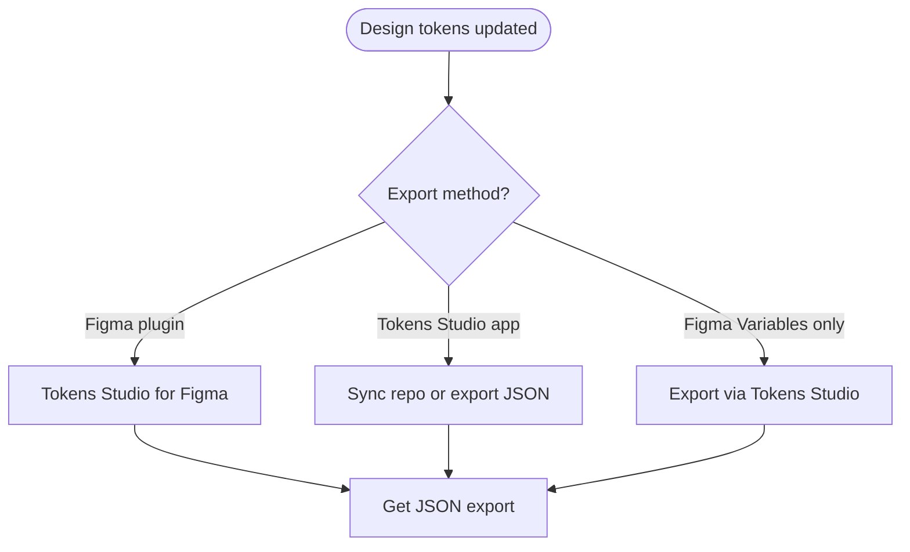
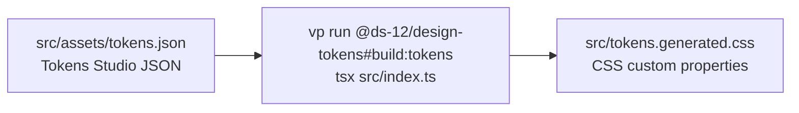
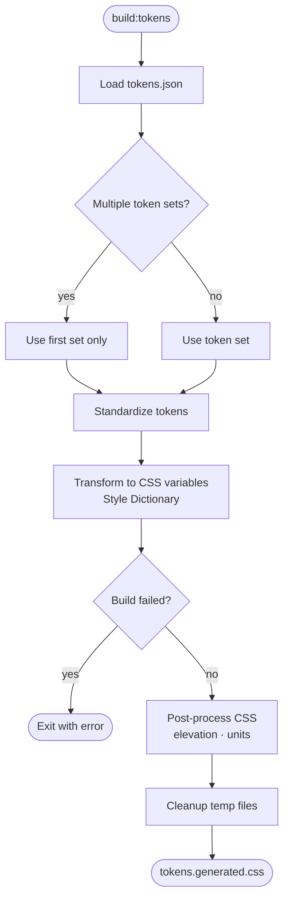
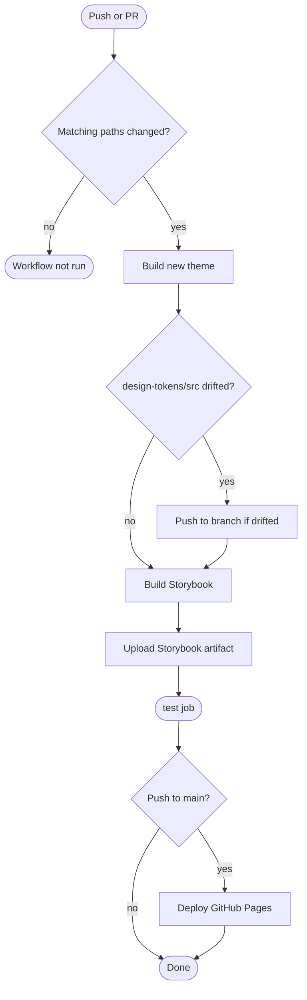

# Token pipeline: Tokens Studio → CSS

End-to-end workflow for how DS-12 design tokens move from Tokens Studio JSON to importable CSS files.

## Overview

```
Figma / Tokens Studio
        │
        ▼  export / sync (manual)
packages/design-tokens/src/assets/tokens.json     ← source of truth (Tokens Studio format)
        │
        ▼  vp run @ds-12/design-tokens#build:tokens
packages/design-tokens/src/tokens.generated.css   ← Style Dictionary output (auto)
        │
        ├─► packages/design-tokens/src/tokens.web.css   ← hand-edited web + component aliases
        │
        ▼  vp run @ds-12/design-tokens#generate:theme
packages/design-tokens/src/tokens.theme.css       ← Tailwind v4 @theme bridge (auto)
        │
        ▼  import in apps / @ds-12/ui (composition layer)
@ds-12/design-tokens/tokens.css  +  theme.css
        │
        ▼  application layer composes @ds-12/ui (not tokens directly for UI)
Consumer app components
```

**Component layers (separate from token pipeline):** Base UI primitives → `@ds-12/ui` composition components → application components in consumer apps. Tokens flow into the composition layer; apps import `@ds-12/ui`, not raw Base UI, for DS-styled controls.

| File                       | Edit?                     | Produced by                                    |
| -------------------------- | ------------------------- | ---------------------------------------------- |
| `src/assets/tokens.json`   | Tokens Studio export only | Designer / Tokens Studio sync                  |
| `src/tokens.generated.css` | No                        | `build:tokens`                                 |
| `src/tokens.web.css`       | Yes                       | Engineers (web-only values, component aliases) |
| `src/tokens.theme.css`     | No                        | `generate:theme`                               |

---

## Step 1 — Get JSON from Tokens Studio

There is **no automated fetch script** in this repo. Tokens arrive as a Tokens Studio JSON export.



| Overview step       | What happens                                                                                                                                                                              |
| ------------------- | ----------------------------------------------------------------------------------------------------------------------------------------------------------------------------------------- |
| **Export method?**  | **Figma plugin** — export from Figma. **Tokens Studio app** — git sync or manual JSON export. **Figma Variables** — must go through Tokens Studio so `$type` / `$value` shape is correct. |
| **Get JSON export** | Download or sync file from Tokens Studio.                                                                                                                                                 |

### Output location

Replace or update:

```
packages/design-tokens/src/assets/tokens.json
```

### Expected JSON shape

Tokens Studio exports follow the [Design Tokens Format Module](https://www.designtokens.org/tr/drafts/format/) — leaf tokens use `$type` and `$value`; groups nest by name. Top-level key is usually a token set name (e.g. `"core"`):

```json
{
  "core": {
    "color": {
      "neutral": {
        "500": {
          "$type": "color",
          "$value": "#949e9d"
        }
      }
    }
  }
}
```

`$themes` and `$metadata` keys are stripped at build time. If multiple top-level token sets exist, only the **first** set is built (a warning is logged).

### Rules

- Do **not** hand-edit `tokens.json` in feature PRs unless you are syncing a Tokens Studio export.
- Commit `tokens.json` when design tokens change.

---

## Step 2 — Build generated CSS (`build:tokens`)

### Overview



Command:

```bash
vp run @ds-12/design-tokens#build:tokens
```

Vite+ task definition (`vite.config.ts`):

- **Command:** `tsx src/index.ts`
- **Inputs:** `src/assets/tokens.json`, `src/**/*.ts`
- **Output:** `src/tokens.generated.css`

### What `src/index.ts` does



Detail behind each step:

| Overview step                  | What happens                                                                                                                                                                       |
| ------------------------------ | ---------------------------------------------------------------------------------------------------------------------------------------------------------------------------------- |
| **Load tokens.json**           | Read `src/assets/tokens.json`; strip `$themes` / `$metadata`.                                                                                                                      |
| **Multiple token sets?**       | If more than one top-level set exists, log warning and build **first set only** (e.g. `"core"`).                                                                                   |
| **Standardize tokens**         | Register `@tokens-studio/sd-transforms` + custom transforms (shadow, line-height, typography); flatten typography aliases; inline shadow refs; write normalized JSON to temp file. |
| **Transform to CSS variables** | Style Dictionary clean + build — kebab-case names, primitive filter, `css/variables` output → `tokens.generated.css`.                                                              |
| **Post-process CSS**           | `postProcessVariablesCss` — inject elevation vars, normalize px / `0px`.                                                                                                           |
| **Cleanup temp files**         | Delete temp dir in `finally` (always runs).                                                                                                                                        |

### Environment

```bash
SD_STRICT_REFERENCES=true vp run @ds-12/design-tokens#build:tokens
```

Fails the build on broken token references instead of console warnings.

### Example output

```css
:root {
  --color-neutral-500: #949e9d;
  --spacing-xsmall: 4px;
  --button-primary-background-color-default-fill: var(--color-brand-500);
}
```

Variable names follow kebab-case paths from the token tree.

---

## Step 3 — Web layer (`tokens.web.css`)

File: `packages/design-tokens/src/tokens.web.css`

Hand-edited layer for values **not** in the Tokens Studio export:

- Focus ring, transitions, cursor
- Web-only dimensions (e.g. `--button-sm-height: 32px`)
- Component-scoped aliases that point at generated tokens
- Figma variable fallbacks when generated names differ

Structure:

```css
@import "./tokens.generated.css";

:root {
  --badge-radius: var(--radius-xsmall);
  --button-sm-height: 32px;
}
```

Package export `@ds-12/design-tokens/tokens.css` resolves to this file.

### Rules

- Prefer `var(--generated-token-name)` over duplicating hex/px values.
- Do not recreate large alias layers when generated names can be used directly in component CSS.
- Never hand-edit `tokens.generated.css`.

---

## Step 4 — Theme bridge (`generate:theme`)

Command:

```bash
vp run @ds-12/design-tokens#generate:theme
```

This task **depends on** `build:tokens` (runs it first if inputs changed).

Vite+ task:

- **Command:** `node scripts/generate-theme.mjs`
- **Inputs:** `tokens.generated.css`, `tokens.web.css`
- **Output:** `src/tokens.theme.css`

### What `generate-theme.mjs` does

1. Scan both CSS files for `--variable-name:` declarations.
2. Map eligible names into Tailwind v4 `@theme inline` entries:
   - Direct: `--color-*`, `--spacing-*`, `--radius-*`, `--border-width-*`, `--font-weight-*`
   - Renamed: `--font-size-*` → `--text-*`, `--line-height-*` → `--leading-*`, etc.
3. Write sorted `@theme inline { … }` block.

Enables utilities like `bg-brand-500`, `text-14`, `leading-20` backed by design tokens.

---

## Step 5 — Full package build

```bash
vp run @ds-12/design-tokens#build
```

Runs `generate:theme` then `vp pack` (TypeScript bundle to `dist/`).

`@ds-12/ui` triggers token regen before its own build:

```json
"prebuild": "vp run @ds-12/design-tokens#generate:theme && node scripts/vendor-fonts.mjs"
```

---

## Step 6 — Consumption

### In `@ds-12/ui`

`packages/ui/src/tailwind.css`:

```css
@import "@ds-12/design-tokens/tokens.css";
@import "@ds-12/design-tokens/theme.css";
```

Component CSS uses `var(--token-name)` — never hardcoded design values.

### Package exports

| Import                                      | Resolves to                |
| ------------------------------------------- | -------------------------- |
| `@ds-12/design-tokens/tokens.css`           | `src/tokens.web.css`       |
| `@ds-12/design-tokens/tokens.generated.css` | `src/tokens.generated.css` |
| `@ds-12/design-tokens/theme.css`            | `src/tokens.theme.css`     |

---

## CI sync

Workflow: `.github/workflows/storybook.yml` — `build` job.

Triggers on push to `main` or PR when paths change: `packages/ui/**`, `packages/design-tokens/**`, `apps/storybook/**`, `tokens/**`.



| Overview step                  | What happens                                                                                                                                                                                                                |
| ------------------------------ | --------------------------------------------------------------------------------------------------------------------------------------------------------------------------------------------------------------------------- |
| **Matching paths changed?**    | Workflow runs only when `packages/ui`, `packages/design-tokens`, `apps/storybook`, or `tokens` change. Push limited to `main`; PRs use any base branch.                                                                     |
| **Build new theme**            | Checkout (PR uses `head_ref`), setup Vite+ + pnpm, `vp install`, then `vp run @ds-12/design-tokens#generate:theme` (`build:tokens` → `tokens.generated.css` + `tokens.theme.css`). Job has `contents: write` for auto-push. |
| **design-tokens/src drifted?** | `git diff --quiet -- packages/design-tokens/src` after generate. Drift = generated CSS out of sync with `tokens.json`.                                                                                                      |
| **Push to branch if drifted**  | Auto-commit `chore: sync design tokens [skip ci]` and push to same branch. `[skip ci]` avoids infinite re-run loop. Skipped when no drift.                                                                                  |
| **Build Storybook**            | `pnpm --filter storybook run build-storybook` — uses synced token CSS.                                                                                                                                                      |
| **test / deploy**              | `test` job runs Playwright interaction + visual/a11y tests. `deploy` runs only on successful `main` push → GitHub Pages.                                                                                                    |

Push **only** `tokens.json` — CI regenerates + commits CSS. Or regenerate locally and commit together.

---

## Developer workflow (cheat sheet)

### Design changed tokens in Figma / Tokens Studio

```bash
# 1. Export → replace src/assets/tokens.json
# 2. Regenerate all CSS
vp run @ds-12/design-tokens#generate:theme

# 3. Optional: add web-only aliases in tokens.web.css, then:
vp run @ds-12/design-tokens#generate:theme

# 4. Commit tokens.json (+ CSS, or let CI sync CSS)
```

### Only web/component aliases changed

```bash
# Edit tokens.web.css
vp run @ds-12/design-tokens#generate:theme
```

### Regenerate primitives only

```bash
vp run @ds-12/design-tokens#build:tokens
```

---

## Custom transforms (reference)

| Module                           | Role                                               |
| -------------------------------- | -------------------------------------------------- |
| `src/transforms/typography.ts`   | Flatten composite typography tokens for CSS output |
| `src/transforms/shadow.ts`       | Shadow alias inlining + CSS shadow transform       |
| `src/transforms/lineHeightPx.ts` | Line-height unit normalization                     |
| `src/utils/css.ts`               | Post-build CSS cleanup (px, elevation)             |
| `src/utils/shadow/`              | Build composed `--elevation-N` variables           |

---

## What not to do

- Do not edit `tokens.generated.css` or `tokens.theme.css` by hand.
- Do not edit `tokens.json` except via Tokens Studio export/sync.
- Do not commit regenerated CSS in feature PRs if only `tokens.json` changed — CI handles sync.
- Do not hardcode colors/spacing in component CSS — use `var(--…)` from generated or web tokens.
